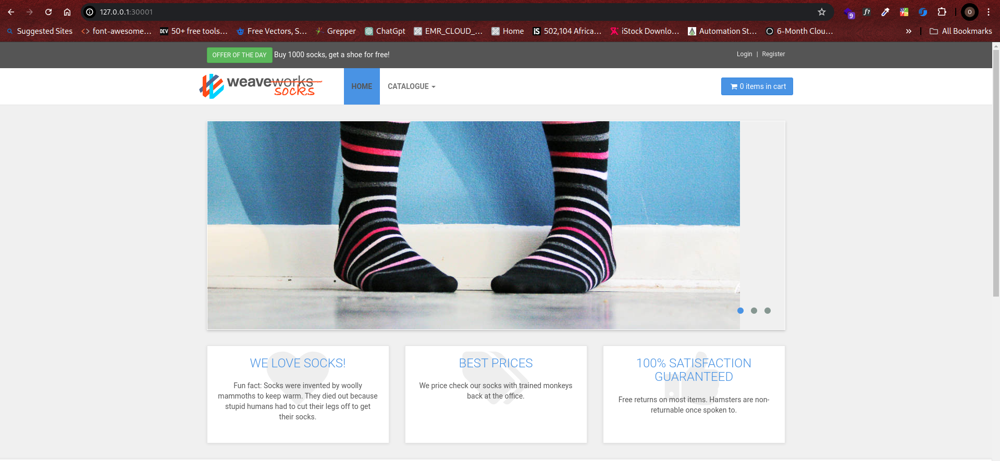
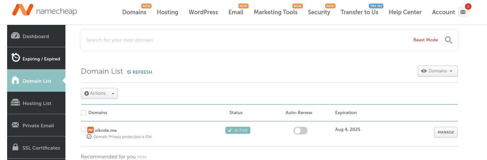

# Detailed Guide: Deploying Socks Shop Microservices-based Application on AWS EKS.

### What is AWS EKS?
Amazon Elastic Kubernetes Service (EKS) is a managed Kubernetes service that makes it easy for you to run Kubernetes on AWS without needing to install, operate, and maintain your own Kubernetes control plane or nodes.

### This managed service automates critical tasks such as:
- Patching: Keeping the Kubernetes control plane up-to-date.
- Node Provisioning: Automatically scaling and managing the worker nodes.
- Security: Integrating with AWS security services for cluster protection.

With EKS, you can focus on running and scaling your applications rather than managing the infrastructure.


## What is Terraform?
Terraform is an open-source tool designed for automating infrastructure management using Infrastructure as Code (IaC). It allows you to define and provision infrastructure using a declarative configuration language called HashiCorp Configuration Language (HCL). 

**Key features include:**
- Automation: Automatically deploy, manage, and update infrastructure resources.
- Version Control: Manage infrastructure changes through code versioning.
- Multi-Provider Support: Manage resources across different cloud providers and on-premises environments.

For more information, refer to [Terraform Documentation](https://www.terraform.io/docs/index.html). 


## What is Ansible?

Ansible is an open-source tool for software provisioning, configuration management, and application deployment. It operates using SSH and does not require an agent to be installed on the managed systems. 

**Key features include:**
- Push-Based Configuration: Ansible pushes configurations from a central location to the managed systems.
- Ease of Use: Simple YAML syntax for defining automation tasks.
- Flexibility: Supports a wide range of systems, including Unix-like and Windows systems.
For further details, visit the [Ansible Documentation](https://docs.ansible.com/ansible/latest/index.html).


# Project Overview

The goal of this project is to deploy the Socks Shop application—a microservices-based e-commerce platform—on an AWS EKS cluster, this deployment will use an Infrastructure as Code (IaC) approach, ensuring automation and scalability. 

**The project involves several key components:**
1.	Infrastructure Provisioning: Using Terraform to set up AWS resources.
1.	Deployment Pipeline: Automating the build and deployment process with GitHub Actions.
1.	Application Deployment: Using Kubernetes for managing application containers.
1.	Monitoring: Implementing Prometheus to track application performance.
1.	Logging: Setting up the ELK Stack (Elasticsearch, Logstash, Kibana) for centralized log management.
1.	Security: Securing the infrastructure using Ansible.

## Project Components
1.	**Infrastructure Provisioning:**
    - Terraform Configuration: Create configuration files to provision AWS resources such as VPCs, subnets, security groups, and the EKS cluster.
1.	**Kubernetes Deployment:**
    - Kubernetes Manifests: Define deployment configurations, services, and ingress resources to deploy the Socks Shop application.
1.	**CI/CD Pipeline:**
    - GitHub Actions: Set up workflows to automate building, testing, and deploying the application to the Kubernetes cluster.
1.	**Monitoring:**
    - Prometheus Configuration: Set up Prometheus to collect and analyse metrics from the Socks Shop application.
1.	**Logging:**
    - ELK Stack Configuration: Configure Elasticsearch, Logstash, and Kibana to collect, analyze, and visualize log data.
1.	**Security:**
    - Ansible Playbooks: Create playbooks to automate security configurations and management of the infrastructure.

## Project Requirements
- Terraform: For automating infrastructure provisioning.
- AWS Account: Needed for creating and managing AWS resources.
- GitHub Actions: For CI/CD pipeline configuration.
- Kubernetes: For orchestrating containerized applications.
- Helm: For managing Kubernetes packages.
- Prometheus: For application monitoring.
- ELK Stack: For centralized logging.
- Let's Encrypt: For obtaining SSL/TLS certificates.
- Docker: For containerizing applications.
- Socks Shop Application: A microservices-based e-commerce application used for demonstration purposes.

## Project Deliverables
1.	**Terraform Configuration Files:**
    - Purpose: Define and deploy AWS infrastructure including VPCs, subnets, security groups, and EKS cluster.
    - Location: Infrastructure directory.

1.	**Deployment Pipeline Configuration:**
    - Purpose: Automate the build and deployment process using GitHub Actions.
    - Location: CI/CD directory.

1.	**Kubernetes Manifests:**
    - Purpose: Deploy the Socks Shop application to the Kubernetes cluster.
    - Location: kubernetes directory.

1.  **Prometheus Configuration:**
    - Purpose: Set up monitoring for the Socks Shop application.
    - Location: Monitoring directory.

1.  **ELK Stack Configuration:**
    - Purpose: Implement centralized logging for log collection and analysis.
    - Location: Logging directory.

1.  **Ansible Playbooks:**
    - Purpose: Secure and manage infrastructure configurations.
    - Location: Security directory.

1.  **Documentation:**
    - Purpose: Provide detailed instructions on setting up and configuring the components.
    - Location: README.md files in each directory.

## Project Objectives
-   Deploy: Implement the Socks Shop application on AWS EKS using IaC.
-   Provision: Use Terraform to set up the necessary AWS infrastructure.
-   Automate: Build and deploy using GitHub Actions.
-   Monitor: Track the application's performance with Prometheus.
-   Log: Collect and analyse logs with the ELK Stack.
-   This project ensures a robust, automated deployment of a scalable e-commerce application on AWS using modern cloud-native tools and practices.

## **Project Structure:**

```
Capstone-Project-Sock-Shop/
├── .github/
│   └── workflows/
│       └── terraform.yaml    # GitHub Actions workflow for CI/CD
|       └── kubernetes.yaml
├── k8s/
│   ├── complete-deploy.yaml   # Kubernetes deployment manifests
│   └── ingress.yaml      # Kubernetes ingress manifest
├── monitoring/
│   ├── prometheus/
│   │   └── values.yaml   # Custom values for Prometheus Helm chart
│   └── grafana/
│       └── values.yaml   # Custom values for Grafana Helm chart
├── logging/
│       ├── elasticsearch.yaml  # Elasticsearch deployment
│       ├── filebeat.yaml       # Fluentd configuration
│       └── kibana-deployment.yaml         # Kibana dashboard configuration
|       └── cronjob.yaml        # Fluentd configuration
|       └── metricbeat.yaml     #  Fluentd configuration
|       └── logstash-deployment.yaml        # Fluentd configuration
├── terraform/
│   ├── main.tf         # Main Terraform configuration for AWS EKS
└──README.md
```

**The project will be organized into the following directories:**

- `Infrastructure`: This directory will contain the Terraform configuration files for provisioning the necessary infrastructure resources on AWS, including VPCs, subnets, security groups, and EKS cluster.
- `kubernetes`: This directory will contain the Kubernetes manifests for deploying the Socks Shop application, including deployment and ingress resources.
- `CI/CD`: This directory will contain the GitHub Actions workflow files for setting up a deployment pipeline to build and deploy the Socks Shop application to the Kubernetes cluster.
- `Monitoring`: This directory will contain the configuration files for setting up Prometheus to monitor the performance and health of the Socks Shop application.
- `Logging`: This directory will contain the configuration files for setting up a centralized logging solution, such as ELK stack, to collect and analyze logs from the Socks Shop application.


## **GETTING STARTED**

**PROJECT LIVE LINK:** [CAPSTONE PROJECT LINK](http://www.vikode.me)

**Socks Shop Resources:** https://github.com/microservices-demo/microservices-demo.github.io

**Demo:** https://github.com/microservices-demo/microservices-demo/tree/master

## **Infrastructure Provisioning:**

Using Terraform, provisioning of the necessary infrastructure resources on AWS, including VPCs, subnets, security groups, and EKS cluster. This will allow for a clear and reproducible infrastructure setup.

1.  Make sure you have installed Terraform alongside AWS CLI on your local machine. If not, you can download it from the official website.

    [AWS CLI Installation guide](https://aws.amazon.com/cli/)

    [Terraform Download](https://www.terraform.io/downloads.html)

1. Configure the AWS CLI with your AWS credentials created in AWS Account by running the following command:

        aws configure


validating configuration by fetechng the user on the Aws account by running the following command:

        aws iam list-users


1.  Navigate into the Terraform directory and create the configuration file.

        cd Terraform
        touch main.tf

1.  Insert the configuration code into the main.tf file to define the AWS provider and the EKS cluster configuration.
```
# Copyright (c) HashiCorp, Inc.
provider "aws" {
  region = var.region
}

module "vpc" {
  source  = "terraform-aws-modules/vpc/aws"

  name = "Sock-Shop-vpc"

  cidr = "10.0.0.0/16"
  azs  = ["us-east-1a", "us-east-1b"]

  private_subnets = ["10.0.1.0/24", "10.0.2.0/24",]
  public_subnets  = ["10.0.4.0/24", "10.0.5.0/24",]

  enable_nat_gateway   = true
  single_nat_gateway   = true
  enable_dns_hostnames = true

  tags = {
    Terraform = "true"
    Environment = "dev"
  }
}

module "eks" {
  source  = "terraform-aws-modules/eks/aws"
  version = "~> 20.0"

  cluster_name    = "eks-Socks-Shop"
  cluster_version = "1.30"

  cluster_endpoint_public_access  = true


  vpc_id                   = module.vpc.vpc_id
  subnet_ids               = module.vpc.private_subnets
  

  # EKS Managed Node Group(s)
  eks_managed_node_group_defaults = {
  ami_type =  "AL2_x86_64"
  }

  eks_managed_node_groups = {
     one = {
      name = "node-group-1"
      # Starting on 1.30, AL2023 is the default AMI type for EKS managed node groups
      
      instance_types = ["t3.medium"]

      min_size     = 1
      max_size     = 2
      desired_size = 2
    }

      two = {
      name = "node-group-2"
      
      instance_types = ["t3.medium"]

      min_size     = 1
      max_size     = 2
      desired_size = 2
    }
  }

  # Cluster access entry
  # To add the current caller identity as an administrator
  enable_cluster_creator_admin_permissions = true
}
```

1.  Run the following command to initialize the Terraform project:

        terraform init
    

1.  Run the following command to create an execution plan:

        terraform plan
    

1.  Run the following command to apply the changes:

        terraform apply --auto-approve
    

        #the flag --auto-approve can be added to avoid the prompt for confirmation.
    

1.  Below is a screenshot of my EKS cluster being provisioned by terraform👇🏽:

    


1.  This below command allow us to configure the kubectl to connect to the EKS cluster, the specified region and the cluster name.

        aws eks update-kubeconfig --name=eks-socks-shop --region=us-east-1

    

1.  create the namespace for the socks shop application by running the following command:

        kubectl create namespace sock-shop

    

1. set the context to the namespace by running the following command:

        kubectl config set-context --current --namespace=sock-shop

1.  After the infrastructure has been provisioned, you will see the output of the Terraform apply command, including the EKS cluster endpoint and the kubeconfig file.

    Apply the deployment manifests to our cluster using the following command:

        kubectl apply -f k8s/deployment.yaml

    
            
9.  The following commands to verify that the Socks Shop application is running on the Kubernetes cluster:

        kubectl get all -A

    
    

        kubectl get pods -n sock-shop
    

10. After all the pods are running, test the application by port-forwarding the service to our local machine using the following command:

        kubectl port-forward service/front-end -n sock-shop 30001:80
    


## **Security: LETS-ENCRYPT**
The application will be secured using HTTPS with a Let's Encrypt certificate. Let's Encrypt is a free, automated, and open certificate authority that provides SSL/TLS certificates for secure communication.

To read further more on letsencrypt- [letsencrypt Documentation]( https://cert-manager.io/docs/installation/helm/)

**Steps to Secure the Application**
- Install certificate-manager using: `kubectl apply -f https://github.com/cert-manager/cert-manager/releases/download/v1.15.2/cert-manager.yaml`


-  Configure the issuer.yaml file
```yaml
    --
apiVersion: cert-manager.io/v1
kind: ClusterIssuer
metadata:
  name: letsencrypt-prod
# namespace: cert-manager
spec:
  acme:
    server: https://acme-v02.api.letsencrypt.org/directory  
    email: victorojetokun24@gmail.com
    privateKeySecretRef:
      name: letsencrypt-prod     
    solvers:
      - selector: {}
        http01:
          ingress:
            class: nginx
```

- Configure the cert.yaml file    
```yaml
apiVersion: cert-manager.io/v1
kind: Certificate
metadata:
  name: vikode-cert
  namespace: sock-shop
spec:
  secretName: vikode-secret
  issuerRef: 
    name: letsencrypt-prod
    kind: ClusterIssuer
  commonName: www.vikode.me
  dnsNames:
  - www.vikode.me
```
    
1.  Use Let's Encrypt to obtain a free SSL/TLS certificate for the Socks Shop application using the following commands:

    - Apply issuer and cert files using kubectl: `kubectl apply -f issuer.yaml` and `kubectl apply -f cert.yaml`

        

    - To access the secret credentials: `kubectl get secret -n sock-shop`
    
    - To access the certificate: `kubectl get certificates -n sock-shop -o wide`

    - To describe the encrpted certificate: `kubectl describe certificate vikode-certificate -n sock-shop`
        

## **Monitoring**
Monitoring the performance and health of the Socks Shop application is crucial. We use Prometheus and Grafana for this purpose.

### Deploying Prometheus
Prometheus is used to collect and store metrics from the application. It monitors various metrics such as request latency, error rate, and request volume.

**Setting up prometheus and Deployment:**

1.  Add the Prometheus Helm Repository

        helm repo add prometheus-community https://prometheus-community.github.io/helm-charts
        helm repo update

1.  Install Prometheus

    Use the following command to install Prometheus with Helm:

        helm install prometheus prometheus/kube-prometheus-stack
            
    This command installs Prometheus with the default configuration. 
    You can customize the installation by specifying additional parameters or a custom values file.
    
1.  Verify the Installation

    Check the status of your Helm release to verify that Prometheus has been installed successfully.

            helm status prometheus

1.  Navigate into Monitoring_Tools directory
    
        cd Monitoring_Tools
        ls -1
    

1.  Create Monitoring Namespace

    - First, create a namespace for monitoring using the 00-monitoring-ns.yaml file:

            kubectl create -f Monitoring_Tools/00-monitoring-ns.yaml  

1.  Deploy Prometheus

    - Apply all Prometheus manifests (files 01-10) to deploy Prometheus:

            kubectl apply $(ls *-prometheus-*.yaml | awk ' { print " -f " $1 } ')

    

1.  Expose Prometheus

    - Expose the Prometheus server on NodePort 31090 using the following command:

            kubectl port-forward service/prometheus 31090:9090 -n monitoring
    

1. it could also be accessed via the web browser: [prometheus.vikode.me](http://prometheus.vikode.me)

1.  output of the Prometheus landing page:
         
         


### Deploying Grafana

**Grafana**
Grafana is used to visualize the metrics collected by Prometheus and create dashboards.
1.  Navigate into Monitoring_Tools directory
    
        cd Monitoring_Tools
        ls -1
    
1.  Add the Grafana Helm repository:

        helm repo add grafana https://grafana.github.io/helm-charts

1.  Update the Helm repositories:

        helm repo update

1.  Create a namespace for Grafana (optional but recommended):

        kubectl create namespace monitoring

1.  Install Grafana using Helm:

        helm install grafana grafana/grafana --namespace monitoring

1.  VAlidate all dependencies and packages are installed
    
        helm repo ls
    
        

1.  Apply the grafana manifests from 20 to 22:

        kubectl apply $(ls *-grafana-*.yaml | awk ' { print " -f " $1 }'  | grep -v grafana-import)
    

1.  Once the grafana pod is in the Running state apply the `23-grafana-import-dash-batch.yaml` manifest to import the Dashboards:

        kubectl apply -f 23-grafana-import-dash-batch.yaml
    

1.  To validate Grafana manifests and Prometheus runnung on the pods
            
            kubectl get pods
    

1.  Grafana will be exposed on the NodePort `31300` using the following command:

        kubectl port-forward service/grafana 31300:80 -n monitoring

    

1. Grafana could also be accessed via the web browser: [grafana.vikode.me](http://grafana.vikode.me)

    Insert username: `admin` and password:`prom-operator` to login to the Grafana dashboard.

    
    

    - Below is the screenshot shows the sock-shop been monitored:👇🏽
        
        
        
        
        

## **Logging:**

To monitor and analyze logs from the Socks Shop application, we will implement the ELK Stack. The ELK Stack is a powerful set of open-source tools that includes Elasticsearch, Logstash, and Kibana. These tools, developed by Elastic, work together to collect, search, analyze, and visualize log data in real-time.

-   **Elasticsearch:** Stores and indexes log data, allowing for quick and efficient searches.
-   **Logstash:** Acts as a data processing pipeline, collecting log data from various sources, filtering it, and sending it to Elasticsearch.
-   **Kibana:** Provides a user-friendly interface to visualize and explore the log data stored in Elasticsearch.

After deploying the ELK Stack to our Kubernetes cluster, we verified that the logging services were successfully running. This ensures that logs from the Socks Shop application are being collected and stored correctly.

To access the Kibana dashboard (which is part of the ELK stack), we use a port-forwarding command. This allows us to access the service locally on our machine:

        kubectl port-forward service/kibana 5601:5601 -n kube-system

After running this command, Kibana can be accessed by opening your web browser and navigating to http://localhost:5601. Here, we can view, search, and analyze logs from the Socks Shop application.
    
- Output as seen as follows:


### **Deploying ingress load balancer**

For more information about about [Nginx Ingress Documentation](https://artifacthub.io/packages/helm/ingress-nginx/ingress-nginx)

### Installing an Ingress Load Balancer and Applying the ingress.yml File

1. Install Ingress Controller
    - Use a Helm chart to install an NGINX Ingress Controller, which will serve as your load balancer.
    - Add the Ingress NGINX repository:

            helm repo add ingress-nginx https://kubernetes.github.io/ingress-nginx

    - Update your Helm repository:

            helm repo update
        

    - Install the NGINX Ingress Controller:

            helm install ingress ingress-nginx/ingress-nginx
        

    - Verify the installation:
    
                helm repo ls
                helm search repo ingress

    - screenshot seen as follows

     
     
1. Create an ingress.yml File
An ingress.yml file defines rules for routing traffic to your services. Here's an example:
```yaml
apiVersion: networking.k8s.io/v1
kind: Ingress
metadata:
  name: combined-ingress
  namespace: sock-shop
  annotations:
    kubernetes.io/ingress.class: nginx
    cert-manager.io/cluster-issuer: letsencrypt-prod

spec:
  ingressClassName: nginx
  rules:
    - host: www.vikode.me
      http:
        paths:
          - pathType: Prefix
            path: /
            backend:
              service:
                name: front-end
                port:
                  number: 80

    - host: grafana.vikode.me
      http:
        paths:
          - pathType: Prefix
            path: /
            backend:
              service:
                name: prometheus-grafana
                port:
                  number: 80

    - host: prometheus.vikode.me
      http:
        paths:
          - pathType: Prefix
            path: /
            backend:
              service:
                name: prometheus-kube-prometheus-prometheus
                port:
                  number: 9090

  tls:
    - hosts:
        - prometheus.vikode.me
        - grafana.vikode.me
        - www.vikode.me
      secretName: vikode-secret
```

1. Apply the ingress.yml File
    - Deploy the Ingress Resource:

        kubectl apply -f ingress.yml

    

1. kubect get ingress

    


### Sourcing Domain Name from Namecheap Domain and Configuring Route53

### Domain Name

1. Visit Namecheap Website:
    - Go to Namecheap.com.

1. Search for a Domain:
    -Use the search bar on the homepage to enter your desired domain name.
    - Namecheap will display available domains and alternatives with different extensions (e.g., .com, .net, .org).

1. Select and Purchase:
    - Choose your preferred domain from the list.
    - Add it to your cart and proceed to checkout.
    - Complete the payment process to purchase the domain.

### Managing Domain Names with Custom DNS for AWS Route 53

1. Create a Hosted Zone in AWS Route 53:
    - Go to the AWS Management Console.
    - Navigate to Route 53 under Networking & Content Delivery.
    - Click on Hosted Zones and then Create Hosted Zone.
    - Enter your domain name and choose a type (Public or Private).
    - AWS will generate a list of DNS values (Name Servers and Record Sets).

1. Copy AWS Route 53 Name Servers:

    - After creating the hosted zone, note the Name Server (NS) records provided by AWS.

1. Update Namecheap DNS Settings:

    - Log in to your Namecheap account.
    - Go to Domain List from the dashboard.
    - Find your domain and click on Manage next to it.
    - In the Nameservers section, choose Custom DNS from the dropdown.
    - Enter the AWS Route 53 Name Server values into the fields provided.
    - Click Save to apply the changes.

1.  DNS Propagation:

    - It may take a few minutes to 48 hours for DNS changes to propagate globally.

***The following are screenshots to illustrate the process as explained above:***





## **Deployment Pipeline:**

The deployment pipeline for the Socks Shop application is configured using a GitHub Actions workflow file. This file defines the necessary steps to build and deploy the application whenever changes are pushed to the main branch of the repository. 

**Here are the steps involved in the deployment pipeline:**

1.  Checkout the Source Code

    - The first step is to checkout the source code from the repository. This ensures that the latest code changes are available for the build and deployment process.

1.  Deploy to Kubernetes

    -   Finally, the workflow deploys the Socks Shop application to the Kubernetes cluster. This step involves creating or updating the Kubernetes and terraform resources (such as deployments, services, etc.) to run the application.

The deployment pipeline will be configured to run automatically whenever changes are pushed to the main branch (kubernete) and Terraform branch of the repository, ensuring that the Socks Shop application is always up to date and running the latest version.

##  **Workflow Configuration**
The workflow file must be placed in the root directory of your repository so that GitHub Actions can detect it automatically. The deployment pipeline is configured to run automatically whenever changes are pushed to the main branch and Teeraform branch, ensuring that the application is always up to date and running the latest version.

- cd .github/workflows to access the CI/CD files

- kubernete.yml

```yaml
name: CI/CD for Kubernetes

# Controls when the workflow will run

on:
  push:
    branches:
      - main
  pull_request:
    branches:
      - main

# Allows you to run this workflow manually from the Actions tab
  workflow_dispatch:
# A workflow run is made up of one or more jobs that can run sequentially or in parallel
jobs:
# This workflow contains a single job called "build"
  build:
    # The type of runner that the job will run on
    runs-on: ubuntu-latest

# Steps represent a sequence of tasks that will be executed as part of the job
    steps:
      # Checks-out your repository under $GITHUB_WORKSPACE, so your job can access it
      - uses: actions/checkout@v4

      - name: Configure AWS credentials
        uses: aws-actions/configure-aws-credentials@v2
        with:
          aws-access-key-id: ${{ secrets.AWS_ACCESS_KEY_ID }}
          aws-secret-access-key: ${{ secrets.AWS_SECRET_ACCESS_KEY }}
          aws-region: us-east-1

      - name: Install kubectl
        uses: azure/setup-kubectl@v3

      - name: Install helm
        uses: azure/setup-helm@v4.2.0

      - name: Update kubeconfig 
        run: |
          aws eks update-kubeconfig --region us-east-1 --name eks-sock-Shop
          kubectl config set-context --current --namespace=eks-socks-shop
          kubectl apply -f https://github.com/jetstack/cert-manager/releases/download/v1.5.3/cert-manager.crds.yaml
          kubectl apply -f https://github.com/cert-manager/cert-manager/releases/download/v1.15.1/cert-manager.yaml


      - name: add helm charts
        run: |
          helm repo add ingress  https://kubernetes.github.io/ingress-nginx  
          helm repo add prometheus  https://prometheus-community.github.io/helm-charts
          

      - name: Update helm charts
        run: helm repo update 

      - name: install helm charts
        run: |
          
          helm upgrade --install prometheus prometheus/kube-prometheus-stack
          helm upgrade --install ingress ingress/ingress-nginx

      - name: run manifest files
        run: kubectl apply -f K8s/complete-deploy.yaml
```

- terraform.yml

```yml
name: terraform

# Controls when the workflow will run
on:
  # Triggers the workflow on push or pull request events but only for the "main" branch
  push:
    branches: 
      - terraform


  # Allows you to run this workflow manually from the Actions tab
  workflow_dispatch:

# A workflow run is made up of one or more jobs that can run sequentially or in parallel
jobs:
  # This workflow contains a single job called "build"
  build:
    # The type of runner that the job will run on
    runs-on: ubuntu-latest

    # Steps represent a sequence of tasks that will be executed as part of the job
    steps:
      # Checks-out your repository under $GITHUB_WORKSPACE, so your job can access it
      - uses: actions/checkout@v4

      - name: Configure AWS credentials
        uses: aws-actions/configure-aws-credentials@v2
        with:
          aws-access-key-id: ${{ secrets.AWS_ACCESS_KEY_ID }}
          aws-secret-access-key: ${{ secrets.AWS_SECRET_ACCESS_KEY }}
          aws-region: us-east-1

      - name: Create s3 bucket
        run: aws s3 mb s3://s3_bucket-socks-shop

      - name: Install kubectl
        uses: azure/setup-kubectl@v3

      - name: Install helm
        uses: azure/setup-helm@v4.2.0


      - name: setup terraform
        uses: hashicorp/setup-terraform@v2
        
      - name: Create EKS cluster
        run: |
          terraform -chdir=Terraform/ init
          terraform -chdir=Terraform apply --auto-approve

      - name: Update kubeconfig 
        run: |
          aws eks update-kubeconfig --region us-east-1 --name eks-socks-shop
          kubectl create namespace sock-shop


```
1. Output Screenshot


## **Conclusion:**
This project demonstrates the importance of automation, monitoring, logging, and security in deploying and managing microservices-based applications. By following the steps outlined, you will have a fully functional deployment pipeline for the Socks Shop application, complete with infrastructure provisioning, monitoring, logging, and security.


## **References:**

- [Terraform Documentation](https://www.terraform.io/docs/index.html)
- [AWS Documentation](https://docs.aws.amazon.com/index.html)
- [Kubernetes Documentation](https://kubernetes.io/docs/home/)
- [Ansible Documentation](https://docs.ansible.com/ansible/latest/index.html)
- [Let's Encrypt Documentation](https://letsencrypt.org/docs/)
- [Docker Documentation](https://docs.docker.com/)
- [Socks Shop Application](https://github.com/microservices-demo/microservices-demo.github.io)
- [GitHub Actions Documentation](https://docs.github.com/en/actions)
- [Prometheus Documentation](https://prometheus.io/docs/)
- [ELK Stack Documentation](https://www.elastic.co/guide/index.html)
